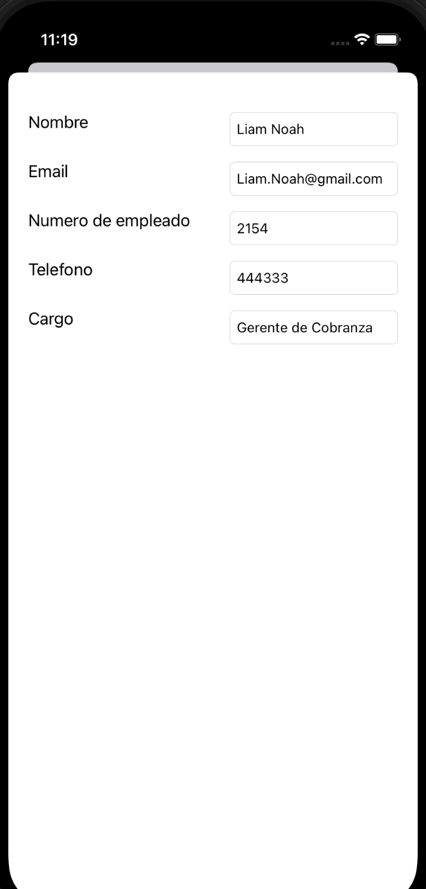

`Desarrollo Mobile` > `Swift Avanzado`

## Reto2

### OBJETIVOS 

- Almacenar datos de tipo numérico, de tipo bool, String hasta objetos.
- Conocer las distintas formas de almacenar datos de manera local en una App.
- Implementar modelos Entidad-Relación en Core data.

 
#### DESARROLLO
Como seguramente en sesiones pasadas, has implementado servicios  y concurrencia, vamos a unirlo con los que hasta ahora ya conoces de Core Data.

Servicio:
https://bedu-swift.herokuapp.com/cobranza.php

En este Reto tenemos la siguiente pantalla:

Donde únicamente contamos con una tabla y un botón con el texto “Consultar Online”

Al dar clic mostrará la segunda pantalla que con 2 botones Reload Data y reload Table.

ReloadData, cargara los datos de un servicio, para posteriormente dar clic en Reload Table y mostrar lo que se cargo del servicio.

Al seleccionar uno de los elementos de la tabla mostrará un alerta, donde informa que se ha cargado la información del usuario y es aquí donde se implementa CoreData, ya que la información cargada del usuario seleccionado ahora se encuentra almacenada en el dispositivo, al dar Back o regresar, se muestra la tabla con la información del elemento al que le hemos dado click.

Al seleccionar el elemento de la pantalla principal despliega la siguiente información:

Nombre 
Email
Num empleado
Telefono
Cargo

